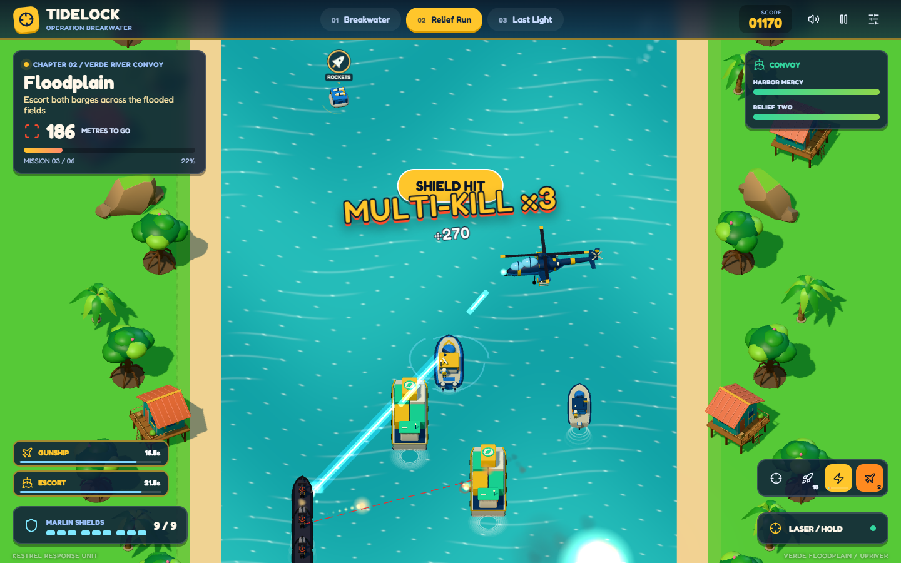
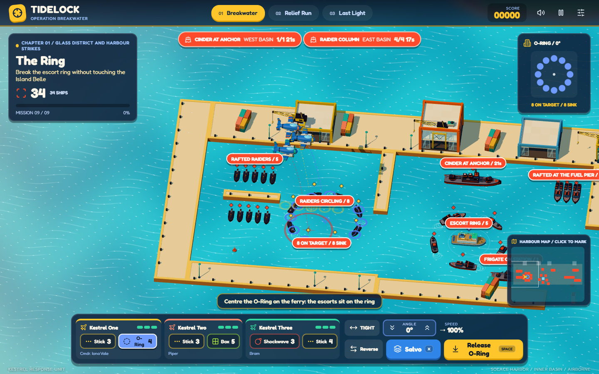
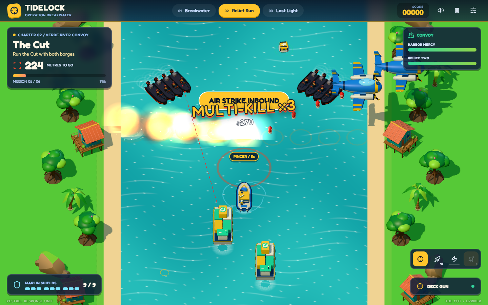
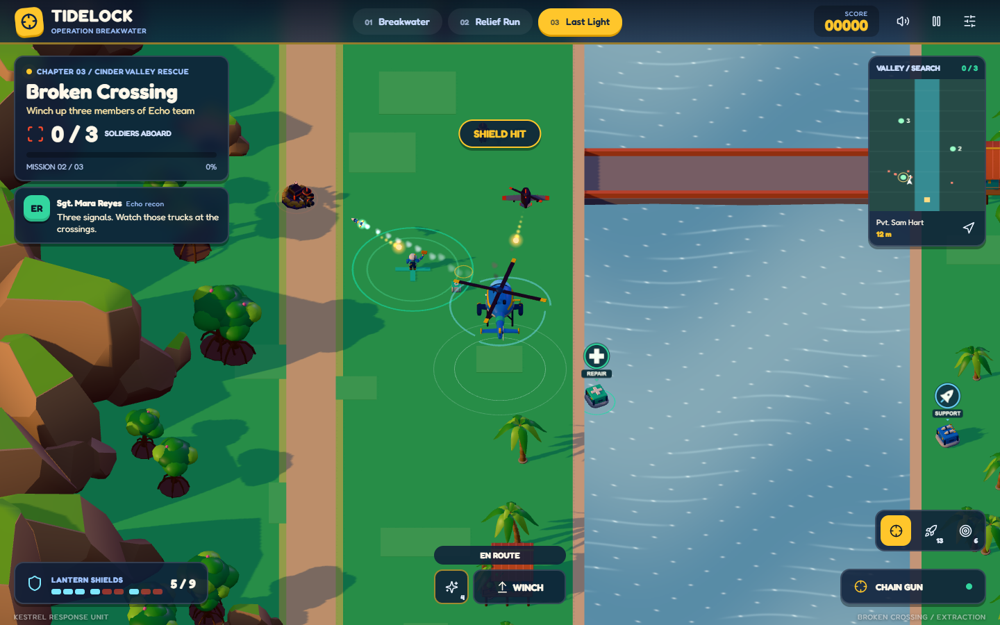
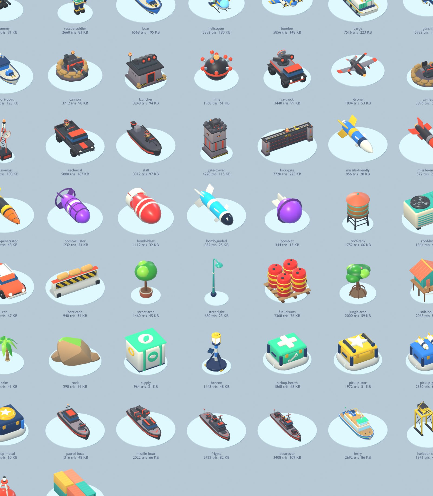

# Tidelock: Operation Breakwater

A three-chapter 3D story campaign for the browser, built with **Three.js**, **cannon-es** and 49 original **Blender** models.

**[Play Tidelock](https://buicongnguyen.github.io/Attack_terrorist_3D/)**


Solace Harbor lies three metres below the tide. Only the Tidelock, a storm barrier at the mouth of the Verde River, keeps it dry. Its designer, now the terrorist leader Marrow, has seized the city's towers and the barrier's control station. He will hold the gates open when Typhoon Ilse peaks at last light tomorrow. You fly for the Kestrel Response Unit.

## Campaign

| Chapter | You command | The job |
| --- | --- | --- |
| **1 Breakwater** (9 missions) | Kestrel Flight: up to three strike aircraft | Break the Front's hold on the Glass District, then its flotilla in the harbour. Echo recon reads the enemy's patrol schedules; time your passes so the gatherings are hit together. |
| **2 Relief Run** (6 missions) | The gunboat *Marlin* | Escort Dr. Okafor's relief barges up the Verde River, across the floodplain, past the sawmill and through the Cut, then break the Highwater lock gate. |
| **3 Last Light** (3 missions) | The rescue helicopter *Lantern* | Winch Echo team out of Cinder Valley and bring the override key home before the storm. |



### Chapter 1: city and harbour strikes

- **Click or tap where the bomb should land.** The flight flies there by itself and releases when the pipper sits on the mark; a mark on a target follows it. A Drill marked on someone indoors sets its own floor. You can still steer by hand, drop at once with Space, or turn round with **Reverse** (F).
- Early bombs hit harder and home a little onto a target they nearly hit (a gold ring shows which), so a near miss still counts. They never home onto a target beside the civilian shelter.
- A destructible city of 2–7-storey towers, three times wider and four times deeper than each mission's district. The camera slides only when the flight goes far, and a map panel shows the whole city (click it to mark a drop). Glass south faces let you see which floors are occupied.
- Four bombs with different jobs:
  - **Drill** punches through slabs and detonates on the floor you set;
  - **Scatter** bursts into eight bomblets over crowds;
  - **Shockwave** tears open roofs and flak nests;
  - **Lance** is a guided bomb for moving trucks.
- The pipper forecasts each aircraft's impact exactly, including the floor a Drill will reach. It stays solid where the impact is visible and turns faint behind buildings. **Salvo** drops one bomb from every aircraft at once.
- Enemies walk scheduled routes through doors, stairs and streets. The intel strip counts down to shift changes, musters and the lieutenants' meeting, when a whole cell stands together. Labels count who is actually at a gathering. Late missions add hiding after the first blast, flak locks you break away from when the HUD says BREAK, a technical convoy, and a civilian shelter that must never be hit. Coach hints guide the teaching missions.
- **The harbour** (missions 1.7–1.9): sink the Front's flotilla, 32 to 41 boats across three basins, with pattern bombs that burst into a line, an L, a U, a ring or a box. The angle buttons point the pattern across, down or on either diagonal. Fit it to a column, a row of raiders, a pier corner, a dry dock, escorts circling a ferry, or boats rafted together. The pipper counts what it will hit and sink. Sink the quota, key ships included, and the rest run. Ships sidestep falling bombs, and the civilian ferry and launch must never be hit.



### Chapter 2: river convoy

- The barges follow Marlin's wake down a wide canal. Guns and skiffs show a red aim line before they fire, and you can block shots with the gunboat.
- Three weapons: the deck gun, rocket salvos that burst, and a laser that burns through gun lines until it overheats. **Q calls an air strike**: Kestrel Two lays a line of bombs across the canal where you aim.
- Crates on the water bring help: the **Hornet gunship** flies your wing and shoots where you shoot, **Duarte's escort launch** guards the barges, and crates of rockets and air strikes restock you.
- Fuel drums and a bridge ammunition crate chain-detonate whole crews. Skiff pincers meet at a marked point, where one hit sets off the rest.
- The Lock Gate boss: two gun towers and skiff pincers, then the shielded generator. Then the gates swing open and the field medal floats out.


- Kills within a second of each other chain into combos.

### Chapter 3: valley rescue

- Hover low and slow over a clear zone and hold the winch. Everyone must return to the Highwater pad.
- You carry a chain gun, rockets, guided missiles and flares. Supply caches, anti-air trucks, cave launchers and drones are spread through a jungle valley at sunset.



Every mission opens with a briefing and ends with a story debrief and star criteria. All eighteen missions can be selected from Mission Control. Progress saves locally, and the game resumes at your first unfinished mission.

## Controls

| Action | Desktop | Touch |
| --- | --- | --- |
| Steer formation (lane, speed) | W S, A D | Left stick |
| Turn the flight round | F | Reverse |
| Mark the drop point | Click the city or the map, right click cancels | Tap the city |
| Payload, release now, salvo | 1–9, Space, X | Payload chips, Release, Salvo |
| Drill floor or pattern angle, formation spacing | E / C, mouse wheel or the angle buttons, Q | Floor ladder, the dial's arrows or the angle buttons, spacing button |
| Move boat or helicopter | WASD / arrows | Left stick |
| Aim and fire | Pointer (hold), or Space | Right stick |
| Gunboat weapons, air strike | 1 gun, 2 rockets, 3 laser (hold), Q | Weapon icons, strike icon |
| Helicopter weapons, flares | 1 gun, 2 rockets, 3 guided, F | Weapon icons, flare icon |
| Winch / land | Hold E over a clear zone | Hold Winch |
| Pause, retry | Esc, R | Top bar |

On portrait phones, Chapter 1's camera looks along the flight path so the district fills the width. Keys are read by physical position, so AZERTY players steer with Z Q S D. The layout follows the input you last used: touch shows the sticks, and a mouse or keyboard shows key hints.

## Run locally

Requires Node.js 22.12+ (or a compatible current release).

```sh
npm ci
npm run dev
```

```sh
npm test                                  # 54 Node tests: rules, schedules, ballistics, harbour fits, story, GLB contracts
npm run build
npm run preview -- --port 5183
npm run test:browser                      # Chrome suite: 250+ checks incl. scripted pilots for all 18 missions
```

The browser tests use system Chrome on Windows (`CHROME_PATH` overrides it) and SwiftShader by default. Set `GPU=1` to render on the real GPU, and `GAME_URL` to test another server. Screenshots go to `test-results/`. The QA handle `window.__TIDELOCK__` exists only with `?qa=1`. Add `&brief=1` or `&prologue=1` to keep the story dialogs in QA runs.

## Blender assets

- **Generators:** [`tools/blender/`](tools/blender/): `style.py` (kit and palette), `catalog.py` (asset contracts), and one asset module per family.
- **Editable library:** [`art/tidelock-assets.blend`](art/tidelock-assets.blend).
- **Runtime models:** [`public/models/`](public/models/). There are 49 GLBs, about 3.6 MiB in total; [`manifest.json`](public/models/manifest.json) records sizes, triangles and nodes.

```sh
blender --background --factory-startup --python tools/blender/build_assets.py -- --output public/models
blender --background --factory-startup --python tools/blender/render_sheet.py -- --models public/models --docs docs
```

The build fails if a node or material the game animates or recolours is missing. The contact sheets in `docs/` are compressed JPEG copies of the renders. At load time the game merges each model's static parts into vertex-coloured meshes, and draws scenery props instanced.



## Design and verification

- [Redesign: evaluation, research, story, mechanics, both review passes and the harbour update](docs/REDESIGN.md)
- [Verification record and known limits](docs/VERIFICATION.md)
- [Credits and licences](docs/CREDITS.md)
- History: [first-release plan](PLAN.md), [rescue chapter notes](docs/CHAPTER3-RESCUE.md), [detail review](docs/REVIEW-DETAILS.md)

## Repository and deployment

SSH remote: `git@github.com:buicongnguyen/Attack_terrorist_3D.git`. Pushing to `main` runs the GitHub Actions workflow: tests, build, the Chrome suite against the production preview, then deployment of `dist/` to GitHub Pages. The build is fully static, with no CDN or server backend.
