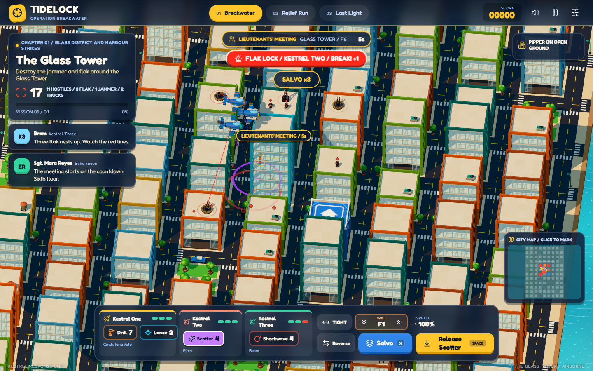

# Tidelock: Operation Breakwater

A playable 3D remake of the Sky Drill arcade campaign, built with **Three.js**, **cannon-es**, and original **Blender** models.

**[Play Tidelock](https://buicongnguyen.github.io/Attack_terrorist_3D/)**



The Ashen Front has closed the Meridia relief corridor. Disable its coastal relays, bring a relief launch upriver, and protect the mountain extraction until the survey crew is safe.

## Campaign

- **Breakwater**: six precision missions. Configure drill, bounce, or timed pods; choose ballistic, hook, or zigzag flight; time your release from the carrier aircraft. Later missions demand room-sized blasts and efficient use of limited ammunition.
- **Relief Run**: three river legs. Pilot a crewed patrol boat, aim its turret, intercept mines, and destroy bank guns and launcher houses. Pickups repair shields or temporarily grant twin automatic guns and guided missiles.
- **Last Light**: three helicopter defenses. Move around the extraction zone, suppress emerging cave launchers, intercept incoming missiles, and protect three independent shield sectors.

All twelve missions are available from Mission Control for testing. Completion records save locally. Retry starts a fresh attempt; only completed best scores are retained.

## Controls

| Action | Desktop | Touch |
| --- | --- | --- |
| Release pod | Space or Release pod | Release pod |
| Adjust pod | Bottom loadout controls | Bottom-left settings icon |
| Move boat / helicopter | WASD or arrow keys | Left stick |
| Aim and fire | Point and hold primary mouse button; Space also fires | Right stick |
| Helicopter weapon | 1 for gun, 2 for rockets | Weapon icons |
| Pause / mission selection | Escape or top settings icon | Top settings icon |
| Retry | R or Mission Control | Mission Control |

## Run Locally

Requires Node.js 22.12+ or a compatible current LTS release.

```sh
npm ci
npm run dev
```

Vite prints the local URL. Use the development server; opening `index.html` directly cannot load JavaScript modules and GLB assets correctly.

```sh
npm test
npm run build
npm run preview -- --port 5183
npm run test:browser
```

Browser tests use system Chrome on Windows. On other platforms, run `npx playwright install chromium` first. Override the executable with `CHROME_PATH` and the served URL with `GAME_URL` when needed. Browser screenshots go to the ignored `test-results/` directory.

## Blender Source

- Editable library: [`art/tidelock-assets.blend`](art/tidelock-assets.blend)
- Reproducible authoring/export script: [`tools/build_assets.py`](tools/build_assets.py)
- Runtime models: [`public/models/`](public/models/)
- Asset sizes and provenance: [`public/models/manifest.json`](public/models/manifest.json)

Regenerate with Blender 4.5 LTS:

```sh
blender --background --python tools/build_assets.py -- --output public/models
```

The 17 GLB models total approximately 1.61 MiB. They include a detailed turret-equipped patrol boat and crew, helicopter, carrier plane, articulated opponent, cannon, launcher house, mine, two missile designs, palm, rock, supply case, beacon, and four distinct floating pickup cases. Geometry and material data are shared between runtime instances; static details are batched by material and articulated pivot during export.

Supply cases use clear camera-facing symbols: a green **+** for shield repair, gold **twin barrels / x2** for twin automatic guns, a cyan **rocket** for guided support, and a gold **medal / +250** for score. Both weapon timers remain visible when bonuses overlap. The boat's gun and missile-rack models also change with its active loadout.

## Design and Verification

- [Detailed evaluation, redesign plan, and future suggestions](PLAN.md)
- [Verification notes and known limitations](docs/VERIFICATION.md)
- [Asset and dependency credits](docs/CREDITS.md)
- [3D detail and pickup readability review](docs/REVIEW-DETAILS.md)

The first release uses a fixed 120 Hz simulation, cannon-es rigid bodies for bombs and fragments, and swept collision tests for fast projectiles. Guided flight programs are arcade mechanics. The forecast stops at first contact; it does not claim an exact preview of later bounces or drilling.

## Repository and Deployment

Local project: `C:\Users\n\source\repos\Attack_terrorist_3D`

SSH remote: `git@github.com:buicongnguyen/Attack_terrorist_3D.git`

The GitHub Actions workflow tests and builds the static game, checks it in Chrome, and deploys `dist/` to GitHub Pages on pushes to `main`. The build uses relative asset paths and bundles runtime dependencies locally. No CDN or server backend is needed during play.

The original [Sky Drill](https://buicongnguyen.github.io/Games/) and [Sky Drill 2](https://buicongnguyen.github.io/SkyDrill2/) remain separate games.
