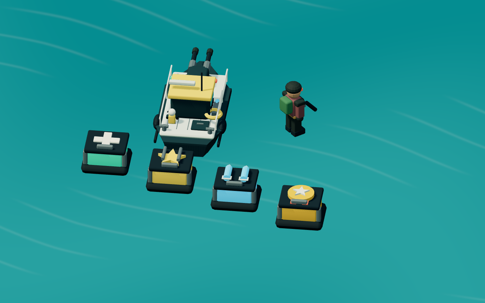

# 3D Detail and Pickup Readability Review

## Scope

Reviewed the rendering, pickup effects, boat weapon feedback, model-authoring pipeline, and related mobile HUD in baseline commit `7cedfe4`. This is a focused gameplay/visual review, not a complete security or campaign-balancing audit.

## Findings and Resolutions

### P2: An active weapon bonus disappears from the HUD

Baseline `src/ui.js:547-551` selected guided support OR twin guns with a ternary. Collecting both hid the twin countdown even while both effects were running. The HUD now presents independent icon, countdown, and duration-bar rows. Each expires separately. Regression checks cover simultaneous collection, independent expiry, and restoration of the ordinary boat loadout.

### P2: Boat turret direction and shot origin disagree

Baseline `src/game.js` aimed the visible turret from player input while automatic twin fire selected another target. Shots originated at a fixed bow offset rather than the rotating barrels. The detailed Blender boat now exports named single/twin muzzle nodes. Manual and automatic gunfire rotate the same turret and spawn at those world-space muzzle positions. Guided support departs from the visible support rack. Browser checks verify muzzle positions, manual alignment, automatic alignment, and normal weapon cooldowns against a moving cannon.

### P2: Pickup symbols are too small and can turn edge-on

Baseline `spawnPickup()` constructed small flat symbols and rotated the entire pickup. Their scale and orientation made repair and weapon rewards difficult to distinguish on phones. Four original Blender cases now carry physical emblems, bumper corners, latches, and distinct colored contents. Camera-facing badges retain a 46-50 CSS-pixel-wide footprint across viewport and camera changes. Symbols identify repair (+), twin guns (barrels/x2), guided support (rocket), and a medal (+250), without relying on color alone.

Badges do not participate in aim raycasts. They temporarily hide when intersecting HUD text or controls; the case remains visible. Disposal removes their scene references while four shared textures/materials remain cached. Collection is idempotent, so an already collected case cannot grant points again.

### Visual QA: Bonus indicators need dedicated mobile space

The first two-row implementation overlapped shield integrity in landscape. Portrait and landscape now have separate compact placement, with smaller sticks on screens up to 375 pixels wide. Browser checks assert non-overlapping bounds for bonuses, shields, and both sticks at 320x740, 390x844, and 844x390.

### Earlier 2D background findings

The current 3D implementation does not use the old canal PNG or painted cannon strips. Water and banks are separate scenery, while mines, cannons, launcher houses, and opponents are gameplay entities. This pass preserves that separation. Pickup badges are presentation only and do not create additional hazards or damage colliders.

## Art Changes

- Boat: deck seams, hatch, fittings, hull strips, navigation lights, radar, lifebuoy, crew details, articulated single/twin guns, and a guided-support rack. Weapon variants reflect active bonuses.
- Helicopter: door/window frames, intakes, exhausts, rocket pods, navigation lights, and rotor details.
- Aircraft: wing panels, trailing flaps, navigation lights, exhausts, and dorsal equipment.
- Opponents: backpacks, utility belts, shoulder protection, boots, and headset details. Existing limb and falling animations remain intact.
- Defenses: cannon recoil and armor details; launcher-house vents, frames, fasteners, and warning markings.
- Mines and missiles: casing seams, collars, bands, and identification details. Friendly cyan and hostile coral remain distinct.
- Four collectible cases, each with a unique emblem and restrained collection ring/particles.

The source Blender library and reproducible export script are committed. There are 17 GLBs totaling 1,685,952 bytes. Material/pivot batching keeps added details from becoming separate draw calls. A matched, paused Chapter 2 desktop snapshot measured 868 draw calls / 54,616 triangles before and 747 calls / 125,392 triangles after. This is a scene-complexity comparison, not a hardware frame-rate benchmark.

## Verification

- 11 Node tests pass, including pickup rules, independent bonuses, and projected badge sizing.
- 54 Playwright assertions pass locally against the production build, with no runtime or resource errors.
- All 17 GLBs load. Named weapon nodes and four animated enemy limbs survive export.
- Existing physics, timed-release completion, manual fire, moving-target hits, shield damage, mine/rocket interaction, cave progression, retry, and failure-priority checks remain passing.
- Desktop and three mobile-emulation viewports produce nonblank WebGL frames. Mobile checks include pixel variation, badge size, HUD bounds, mission selection, and actual joystick input.
- Screenshots were visually inspected for the three chapters, simultaneous bonuses, narrow portrait, landscape, and an enlarged model inspection scene.

## Remaining Limits

Real iOS/Android devices and low-end GPUs still need testing. Higher triangle counts and larger GLBs trade some load/geometry cost for detail; no real-device 60 FPS claim is made. The art remains intentionally stylized and small at normal gameplay scale. Collision sizes and enemy difficulty were preserved rather than enlarged with the decorative geometry.
